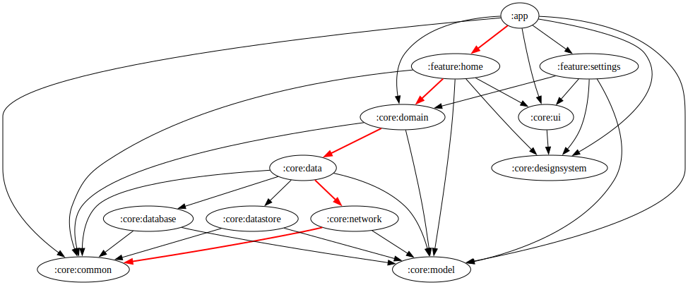

B256 Rocket App
===============

# Módulo :App
## Gráfico de dependência


## Stack
* [MVVM]
* [Jetpack Compose]
* [Flow]
* [Room]
* [Retrofit]
* [Dagger Hilt]

[MVVM]: https://proandroiddev.com/mvvm-architecture-viewmodel-and-livedata-part-1-604f50cda1
[Jetpack Compose]: https://developer.android.com/jetpack/compose
[Flow]: https://github.com/Kotlin/kotlinx.coroutines
[Room]: https://developer.android.com/training/data-storage/room
[Retrofit]: https://square.github.io/retrofit/
[Dagger Hilt]: https://dagger.dev/hilt/

# Caches Gradle:
```bash
./gradlew clean
./gradlew build --refresh-dependencies
```
