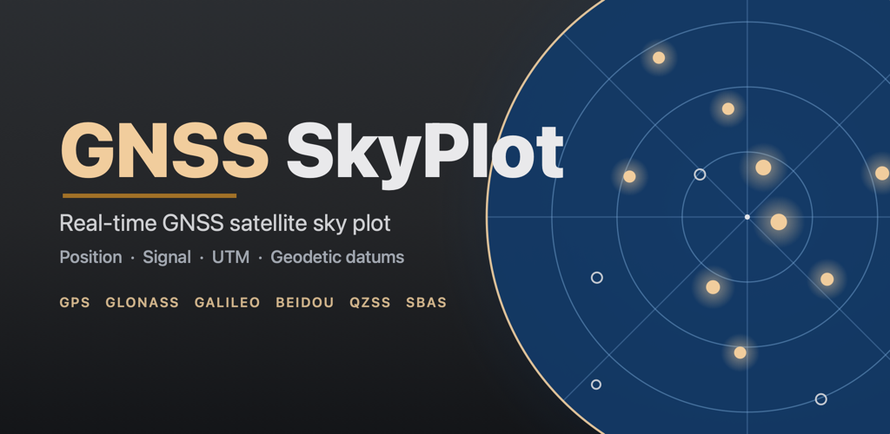
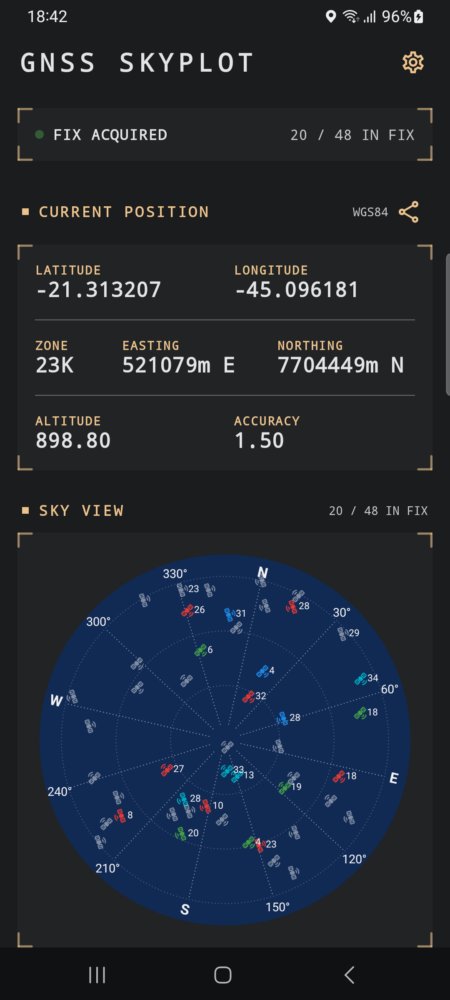
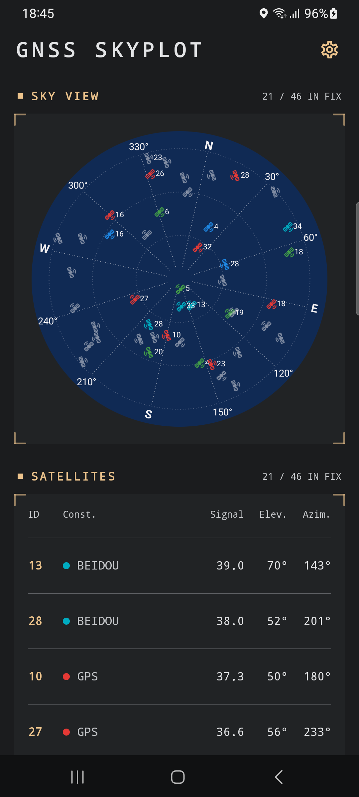
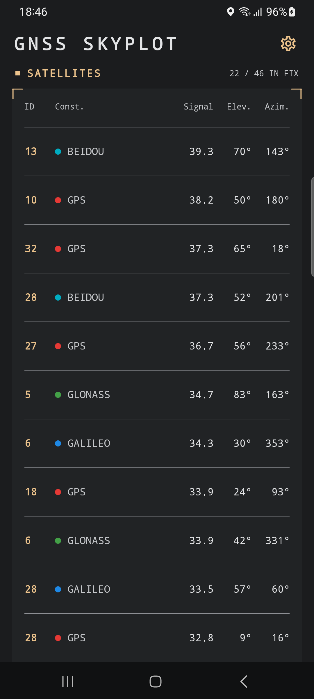
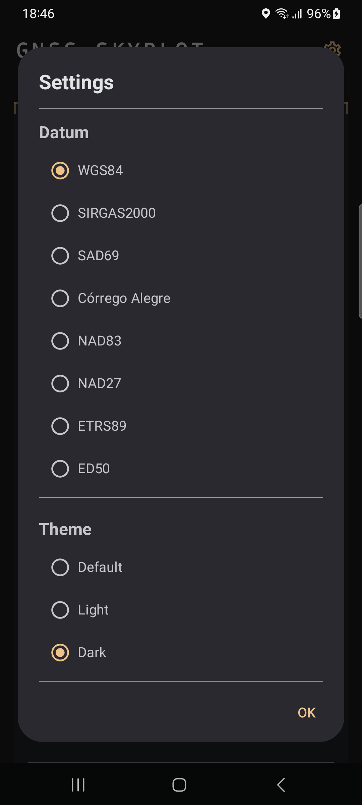
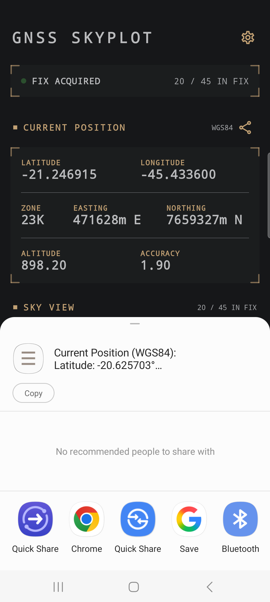
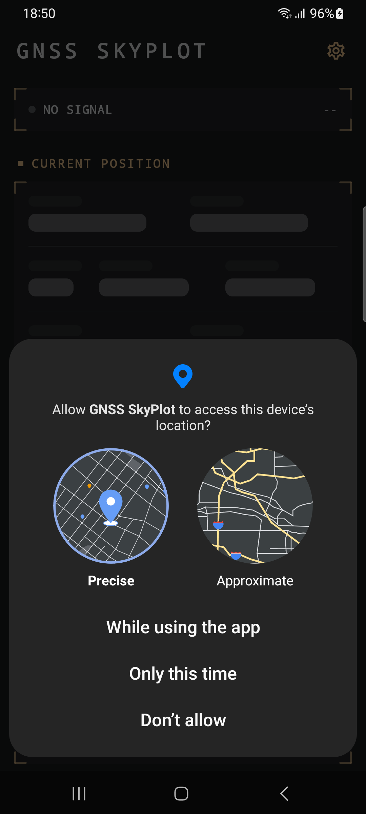
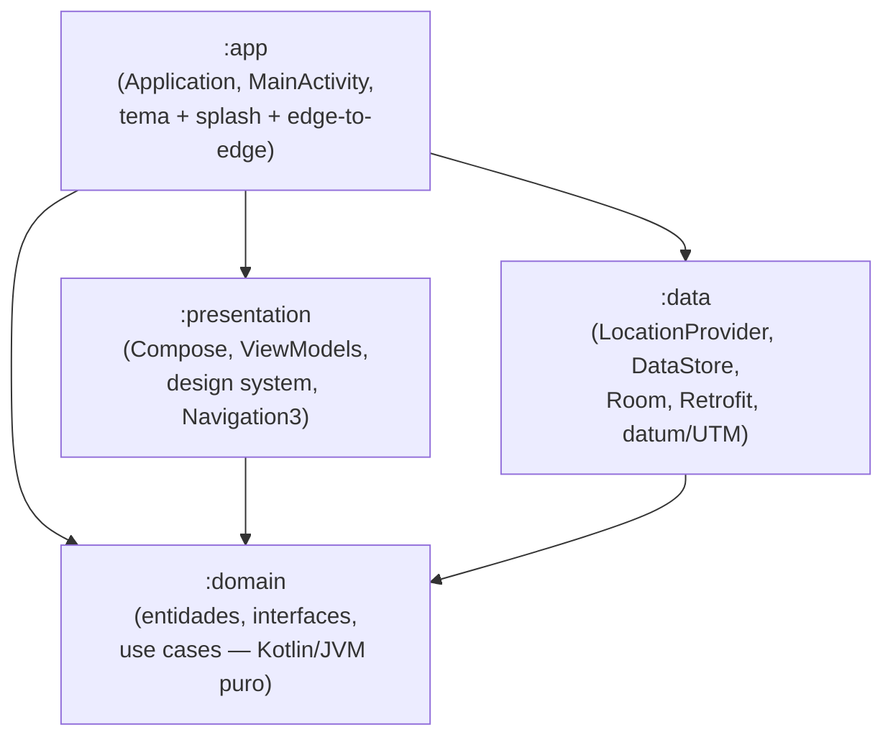
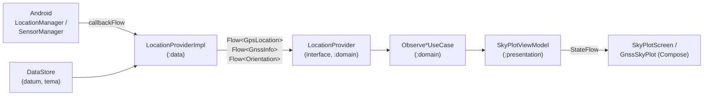

<div align="center">



# GNSS SkyPlot

**Sky plot de satélites GNSS em tempo real, posição, coordenadas UTM e datums geodésicos.**


</div>

---

## Visão geral

**GNSS SkyPlot** transforma o aparelho numa janela em tempo real para os satélites que passam
sobre a sua cabeça. Ao ar livre, o app mostra num gráfico polar (sky plot) cada satélite que o
rádio GNSS do dispositivo consegue rastrear — GPS, GLONASS, Galileo, BeiDou, QZSS, IRNSS e SBAS —
posicionado por **azimute** e **elevação**, colorido por constelação e destacado quando participa
do cálculo da posição (_fix_).

Além do sky plot, o app apresenta a **posição atual** com precisão, a projeção para **UTM**
(zona, easting, northing) e permite exibir as coordenadas em **8 datums geodésicos** diferentes,
não apenas o WGS84 bruto entregue pelo GPS.

O código também serve de **template de arquitetura Android modular** (multi-módulo, Clean
Architecture, Hilt, Compose, `build-logic` com convention plugins) — a maioria dos arquivos traz
KDoc explicando o padrão de referência que representam.

---

## Screenshots

| Tela principal | Sky View + satélites | Lista de satélites |
|:---:|:---:|:---:|
|  |  |  |
| Barra de status (`FIX ACQUIRED`, `20 / 48 IN FIX`), painel **Current Position** (lat/lon, UTM, altitude, precisão) e início do **Sky View**. | Radar polar (N/E/S/W, anéis de elevação, satélites por constelação) e a tabela **Satellites**. | Tabela completa ordenada por intensidade de sinal: `ID`, `Const.`, `Signal`, `Elev.`, `Azim.` |

| Configurações | Compartilhar posição | Permissão / sem sinal |
|:---:|:---:|:---:|
|  |  |  |
| Seleção de **Datum** (WGS84, SIRGAS2000, SAD69, Córrego Alegre, NAD83, NAD27, ETRS89, ED50) e de **Tema** (Default / Light / Dark). | A posição atual é compartilhada como texto pela folha de compartilhamento nativa do Android. | Solicitação de permissão de localização e estado `NO SIGNAL` com _skeleton_ enquanto não há _fix_. |

---

## Funcionalidades

### Sky View (sky plot)

- Gráfico polar com **todos os satélites visíveis**, atualizado a cada segundo
  (`GnssStatus.Callback`).
- Eixo radial = **elevação** (90° no centro / zênite, 0° na borda / horizonte); ângulo =
  **azimute** (0°–360°, Norte no topo).
- O plot **gira para o Norte verdadeiro** conforme o dispositivo é girado, usando a bússola
  (fusão de acelerômetro + magnetômetro, com suavização exponencial).
- Ícones coloridos por constelação; satélites usados no _fix_ recebem o `svid` como rótulo.
- Cores fixas de "instrumento" (fundo azul-noite `#102A54`), independentes do tema claro/escuro,
  para preservar o contraste dos ícones saturados.

### Lista de satélites

- Tabela com **ID (svid)**, **constelação**, **sinal (C/N₀ em dB-Hz)**, **elevação** e
  **azimute** de cada satélite.
- Ordenada por intensidade de sinal (mais forte primeiro).
- Contagem `usados no fix / visíveis` exibida no cabeçalho de cada painel.
- Suporte a **frequência de portadora** e **baseband C/N₀** (GNSS de dupla frequência) quando o
  hardware reporta (API 26+ / API 30+).

### Posição atual

- **Latitude / longitude** com estimativa de **precisão** (accuracy) ao vivo.
- **Altitude** (acima do elipsoide) e **precisão** em metros.
- Projeção **UTM**: zona + banda de latitude, easting e northing (via NASA WorldWind
  `UTMCoord`).
- Botão **compartilhar** — envia a posição atual como texto por qualquer app.
- Estado de _fix_ com três níveis: `NO SIGNAL` → `ACQUIRING SIGNAL` → `FIX ACQUIRED`.

### Datums geodésicos

O GPS sempre entrega a posição em **WGS84**; o app aplica uma transformação de datum (translação
geocêntrica de 3 parâmetros + elipsoide de destino) tanto na latitude/longitude quanto no UTM,
com troca **imediata** ao mudar a opção nas configurações:

| Região | Datums |
|---|---|
| Global | **WGS84** |
| Brasil | **SIRGAS2000**, **SAD69**, **Córrego Alegre** |
| América do Norte | **NAD83**, **NAD27** |
| Europa | **ETRS89**, **ED50** |

> SIRGAS2000, NAD83 e ETRS89 são praticamente coincidentes com o WGS84 (diferença de poucos
> centímetros); SAD69, Córrego Alegre, NAD27 e ED50 recebem translação própria. São
> transformações de 3 parâmetros (exatidão de metros a dezenas de metros) — adequadas para
> navegação e visualização, **não para uso cadastral/jurídico**.

### Constelações e legenda de cores

| Constelação | Rótulo | Cor no plot |
|---|---|---|
| GPS | NAVSTAR | 🔴 vermelho |
| GLONASS | GLONASS | 🟢 verde |
| Galileo | GALILEO | 🔵 azul |
| BeiDou | BEIDOU | 🟦 ciano |
| QZSS | QZSS | 🟣 roxo |
| SBAS | SBAS | 🟠 laranja |
| IRNSS/NavIC | IRNSS | 🟡 amarelo |

### Tema

- **Claro**, **Escuro** ou **Seguir o sistema** — preferência do usuário persistida (DataStore),
  aplicada no nível da `Activity` e sincronizada com a splash screen e as barras de sistema.
- Paleta inspirada em traje espacial (laranja `#DD912E`, cinza `#989DA4`, branco), com tokens
  Material 3 completos para claro e escuro.
- Estética de **console de controle de missão**: tipografia monoespaçada, marcas de canto,
  bordas finas (`MissionHeader`, `MissionStatusBar`, `MissionPanel`).

### Privacidade

- O sky plot e o posicionamento funcionam **100% offline** — sem conta, sem cadastro.
- Sem anúncios.
- A localização é usada apenas em primeiro plano, enquanto o app está aberto.

---

## Arquitetura

Projeto **multi-módulo** seguindo Clean Architecture, com dependências apontando sempre para o
`:domain`:


```mermaid
graph TD
    app[":app<br/>(Application, MainActivity,<br/>tema + splash + edge-to-edge)"]
    presentation[":presentation<br/>(Compose, ViewModels,<br/>design system, Navigation3)"]
    data[":data<br/>(LocationProvider, DataStore,<br/>Room, Retrofit, datum/UTM)"]
    domain[":domain<br/>(entidades, interfaces,<br/>use cases — Kotlin/JVM puro)"]

    app --> presentation
    app --> data
    app --> domain
    presentation --> domain
    data --> domain
```

| Módulo | Tipo | Responsabilidade |
|---|---|---|
| `:domain` | `java-library` (JVM puro) + Hilt core | Entidades (`GnssInfo`, `GnssSatellite`, `GpsLocation`, `UTM`, `Orientation`…), `enums` (`Constellation`, `Datum`, `Theme`), **interfaces** (`LocationProvider`, `SettingsRepository`) e **use cases** (`ObserveGnssStatusUseCase`, `ObserveLocationUseCase`, `ObserveOrientationUseCase`, `GetDatumUseCase`, `SetDatumUseCase`, `GetThemeUseCase`, `SetThemeUseCase`). Não conhece Android. |
| `:data` | `com.android.library` | Implementações: `LocationProviderImpl` (sobre `android.location.LocationManager` + `SensorManager`), `SettingsRepositoryImpl` + `PreferencesDataSource` (DataStore), transformação de datum e projeção UTM, banco Room (`TelemetryEntity`) e camada de rede (Retrofit/OkHttp/kotlinx.serialization). Módulos Hilt em `data/di`. |
| `:presentation` | `com.android.library` + Compose | UI em Jetpack Compose: `SkyPlotScreen` + `GnssSkyPlot` (Canvas), `SettingsDialog`, `ViewModels` (`@HiltViewModel`), design system (tema, cores, tipografia, dimens) e navegação (Navigation 3). |
| `:app` | `com.android.application` | `B256Application` (`@HiltAndroidApp`), `MainActivity` single-activity, sincronização de tema/splash/barras de sistema, composição raiz (`B256App` + `B256NavDisplay`). |

### Fluxo de dados


```mermaid
graph LR
    LM["Android<br/>LocationManager /<br/>SensorManager"] -->|callbackFlow| LPI["LocationProviderImpl<br/>(:data)"]
    DS["DataStore<br/>(datum, tema)"] --> LPI
    LPI -->|"Flow&lt;GpsLocation&gt;<br/>Flow&lt;GnssInfo&gt;<br/>Flow&lt;Orientation&gt;"| LP["LocationProvider<br/>(interface, :domain)"]
    LP --> UC["Observe*UseCase<br/>(:domain)"]
    UC --> VM["SkyPlotViewModel<br/>(:presentation)"]
    VM -->|StateFlow| UI["SkyPlotScreen /<br/>GnssSkyPlot (Compose)"]
```

- **Localização**: `LocationManager.GPS_PROVIDER` diretamente (sem Google Play Services /
  FusedLocationProvider), via `requestLocationUpdates` a cada 1 s.
- **Satélites**: `registerGnssStatusCallback` → `GnssStatus` mapeado para `GnssInfo` /
  `GnssSatellite`.
- **Bússola**: `SensorManager` (acelerômetro + campo magnético) → matriz de rotação → azimute.
- **Datum**: o `Flow` de posição é combinado (`combine`) com o `Flow` do datum selecionado, de
  modo que trocar o datum reflete na tela sem esperar um novo _fix_.
- **ViewModels**: expõem `StateFlow` com `stateIn(WhileSubscribed(5_000))`; a UI coleta com
  `collectAsStateWithLifecycle()`.

### Injeção de dependência (Hilt)

| Módulo | Fornece |
|---|---|
| `ServiceModule` | `LocationProvider` → `LocationProviderImpl` (`@Provides @Singleton`) |
| `RepositoryModule` | `SettingsRepository` → `SettingsRepositoryImpl` (`@Binds`) |
| `DataStoreModule` | `DataStore<Preferences>` |
| `DatabaseModule` | `RoomDatabase` + DAOs |
| `NetworkModule` | `Json`, `Call.Factory` (OkHttp lazy), `baseUrl` a partir de `BuildConfig.NETWORK_BASE_URL` |

### Navegação

Single-activity com **Navigation 3** (`androidx.navigation3`): `B256NavDisplay` monta o
`NavDisplay` e cada feature registra seus destinos via extension
(`EntryProviderScope<NavKey>.skyPlotScreen()`). Rotas são `NavKey` `@Serializable`
(`SkyPlotRoute` é um `data object`).

### `build-logic` / convention plugins

Toda a configuração de build fica em `build-logic/convention` (composite build), aplicada pelos
módulos como plugins `b256.*`:

| Plugin | Uso |
|---|---|
| `b256.android.application` | módulo `:app` (compileSdk 37, targetSdk 37, minSdk 29) |
| `b256.android.library` | `:data` |
| `b256.jvm.library` | `:domain` |
| `b256.presentation` | `:presentation` (biblioteca Android + Compose) |
| `b256.android.compose` | configuração do Compose |
| `b256.hilt` | Hilt + KSP |
| `b256.android.room` | Room + KSP + schemas exportados |
| `b256.flavors` | flavors `develop` / `production` (dimensão `contentType`) |
| `b256.android.test` | dependências de teste (JUnit, Turbine, MockK, Robolectric) |
| `b256.root` | tasks utilitárias na raiz |

Recursos de build ativados: `org.gradle.parallel`, `caching`, `configuration-cache` (+ paralelo),
`ksp.project.isolation`. Version catalog em `gradle/libs.versions.toml`.

### Flavors

| Flavor | `applicationId` | Observação |
|---|---|---|
| `develop` | `br.com.b256.utm.develop` | instalável lado a lado com produção |
| `production` | `br.com.b256.utm` | — |

---

## Stack

| Área | Tecnologia |
|---|---|
| Linguagem | Kotlin 2.4.10 (JVM 11 nos módulos, JVM 17 no `build-logic`) |
| Build | Android Gradle Plugin 9.3.2, Gradle (wrapper), KSP, `build-logic` convention plugins |
| UI | Jetpack Compose (BOM 2026.08.00), Material 3, Compose Canvas (sky plot) |
| Navegação | AndroidX **Navigation 3** (`navigation3-runtime` / `-ui`) |
| DI | Dagger **Hilt** 2.60.1 |
| Assíncrono | Kotlin Coroutines + **Flow** (`callbackFlow`, `combine`, `flatMapLatest`, `stateIn`) |
| Persistência | **Jetpack DataStore** (Preferences) — tema e datum; **Room** 2.8.4 — telemetria |
| Rede | **Retrofit** 3 + **OkHttp** 5 + `kotlinx.serialization` (health-check `getPing`) |
| Localização | `android.location.LocationManager` + `GnssStatus` + `SensorManager` |
| Geodésia | NASA WorldWind `ww-geo-coords` (`UTMCoord`) + transformação de datum própria |
| Permissões | Accompanist Permissions |
| Data/hora | `kotlinx-datetime`, `kotlin.time.Instant` |
| Testes | JUnit4, `kotlinx-coroutines-test`, **Turbine**, **MockK**, **Robolectric**, MockWebServer |
| Qualidade | Spotless + ktlint |

---

## Estrutura de pastas

```
gnss/
├── app/                      # :app — Application, MainActivity, composição raiz
│   └── src/main/java/br/com/b256/gnss/
│       ├── B256Application.kt
│       ├── MainActivity.kt / MainActivityViewModel.kt
│       └── ui/B256App.kt
├── domain/                   # :domain — Kotlin/JVM puro
│   └── src/main/java/br/com/b256/domain/
│       ├── entities/         # GnssInfo, GnssSatellite, GpsLocation, UTM, Orientation, ...
│       │   └── enums/        # Constellation, Datum, Theme
│       ├── interfaces/       # LocationProvider, SettingsRepository
│       └── usecases/         # Observe*/Get*/Set* use cases
├── data/                     # :data — implementações
│   └── src/main/java/br/com/b256/data/
│       ├── services/location/# LocationProviderImpl + extensões (Datum.kt, Location.kt)
│       ├── datastore/        # PreferencesDataSource
│       ├── database/         # Room (RoomDatabase, dao/, entities/, mapper/)
│       ├── network/          # Retrofit (Network, NetworkImpl, api/, model/, mapper/)
│       ├── repositories/     # SettingsRepositoryImpl
│       └── di/               # ServiceModule, RepositoryModule, DataStoreModule, DatabaseModule, NetworkModule
├── presentation/             # :presentation — Compose
│   └── src/main/java/br/com/b256/presentation/
│       ├── skyplot/          # SkyPlotScreen, SkyPlotViewModel, components/GnssSkyPlot, navigation/
│       ├── settings/         # SettingsDialog, SettingsViewModel
│       ├── navigation/       # Navigation.kt (B256NavDisplay)
│       └── designsystem/     # theme/, component/, asset/
├── build-logic/convention/   # convention plugins b256.*
├── docs/                     # feature graphic + screenshots
└── gradle/libs.versions.toml # version catalog
```

---

## Como compilar e rodar

### Requisitos

- **JDK 17** (para o `build-logic`)
- **Android Studio** (versão compatível com AGP 9.3.2) ou apenas o Android SDK + `gradlew`
- Um dispositivo/emulador com **Android 10 (API 29)** ou superior

### Configuração

Crie/edite o `local.properties` na raiz com o caminho do SDK e (opcionalmente) a URL da API de
health-check:

```properties
sdk.dir=/caminho/para/Android/sdk
NETWORK_BASE_URL=https://example.com/
```

> Sem `NETWORK_BASE_URL` o build usa `http://example.com` como _fallback_; a chamada de rede é
> apenas um `getPing()` de referência e não é necessária para o funcionamento do sky plot.

### Comandos

```bash
# Compilar o debug
./gradlew :app:assembleProductionDebug

# Instalar em um dispositivo conectado
./gradlew :app:installProductionDebug

# Testes unitários (todos os módulos)
./gradlew test

# Testes instrumentados
./gradlew connectedAndroidTest

# Formatação
./gradlew spotlessApply

# Limpar caches de dependência
./gradlew clean
./gradlew build --refresh-dependencies
```

### Testar coordenadas falsas (screenshots)

As telas de **posição/UTM/datum** leem `LocationManager.GPS_PROVIDER`, então funcionam com um app
de _mock location_ (Opções do desenvolvedor → "Selecionar app de simulação de localização"). O
**Sky View** depende de `GnssStatus` do hardware e **não** é preenchido por mock — use o emulador
do Android Studio (API 33+ gera satélites sintéticos) ou capture ao ar livre.

---

## Permissões

| Permissão | Motivo |
|---|---|
| `ACCESS_FINE_LOCATION` / `ACCESS_COARSE_LOCATION` | obter a posição e registrar o `GnssStatus.Callback` (satélites) |
| `FOREGROUND_SERVICE` / `FOREGROUND_SERVICE_LOCATION` | declaradas para rastreamento em primeiro plano |

A permissão de localização é solicitada em tempo de execução na primeira abertura da tela
(`LocationPermissionEffect`, via Accompanist).

---

## Limitações

- O Sky View, os dados de sinal e as constelações disponíveis dependem do **hardware GNSS** do
  aparelho e de uma **visão limpa do céu**.
- As transformações de datum são de 3 parâmetros (Molodensky abreviado), não as grades oficiais
  (NTv2, ProGriD, etc.); a projeção UTM usa o elipsoide WGS84 em todos os datums, com pequeno
  erro residual para elipsoides mais distintos (Hayford, em Córrego Alegre e ED50).
- `br.com.b256.utm` é o `applicationId` histórico (o app começou como conversor UTM).

---

## Licença

Veja [LICENSE](LICENSE).
