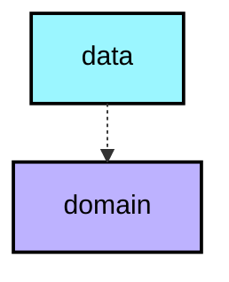
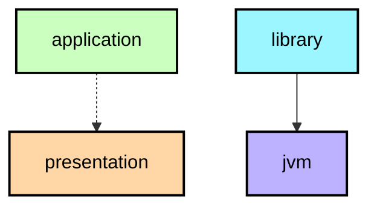

# `:data`

## Module dependency graph

<!--region graph-->

```mermaid
---
config:
  layout: elk
  elk:
    nodePlacementStrategy: SIMPLE
---
graph TB
  :domain[domain]:::jvm-library
  :data[data]:::android-library

  :data -.-> :domain

classDef android-application fill:#CAFFBF,stroke:#000,stroke-width:2px,color:#000;
classDef android-presentation fill:#FFD6A5,stroke:#000,stroke-width:2px,color:#000;
classDef android-library fill:#9BF6FF,stroke:#000,stroke-width:2px,color:#000;
classDef jvm-library fill:#BDB2FF,stroke:#000,stroke-width:2px,color:#000;
classDef unknown fill:#FFADAD,stroke:#000,stroke-width:2px,color:#000;
```

📋 Legenda do gráfico

```mermaid
graph TB
  application[application]:::android-application
  presentation[presentation]:::android-presentation
  library[library]:::android-library
  jvm[jvm]:::jvm-library

  application -.-> presentation
  library --> jvm

classDef android-application fill:#CAFFBF,stroke:#000,stroke-width:2px,color:#000;
classDef android-presentation fill:#FFD6A5,stroke:#000,stroke-width:2px,color:#000;
classDef android-library fill:#9BF6FF,stroke:#000,stroke-width:2px,color:#000;
classDef jvm-library fill:#BDB2FF,stroke:#000,stroke-width:2px,color:#000;
classDef unknown fill:#FFADAD,stroke:#000,stroke-width:2px,color:#000;
```

<!--endregion-->
